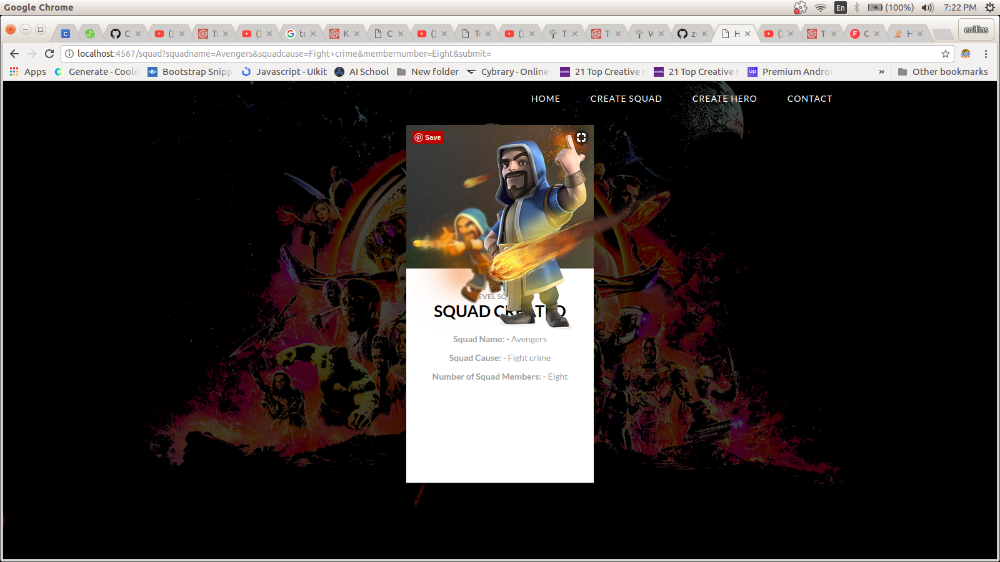
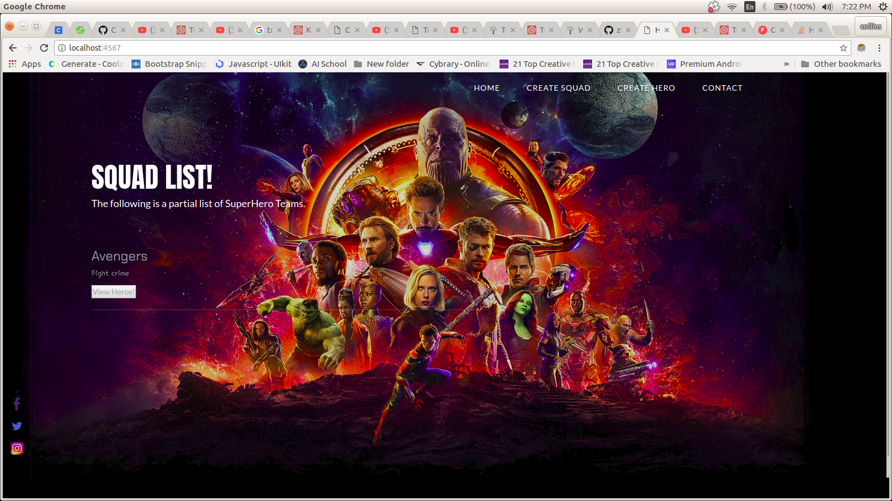
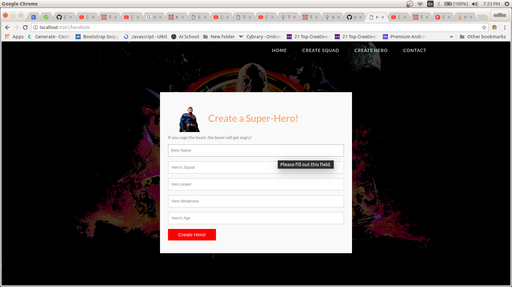
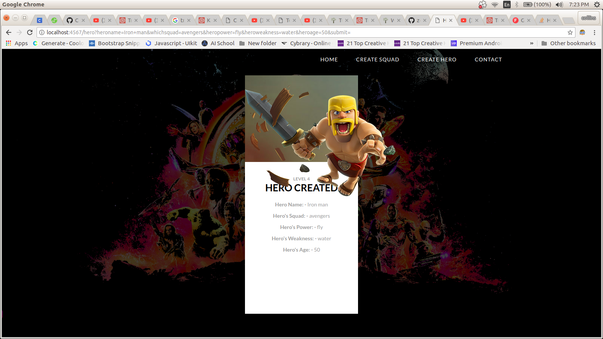
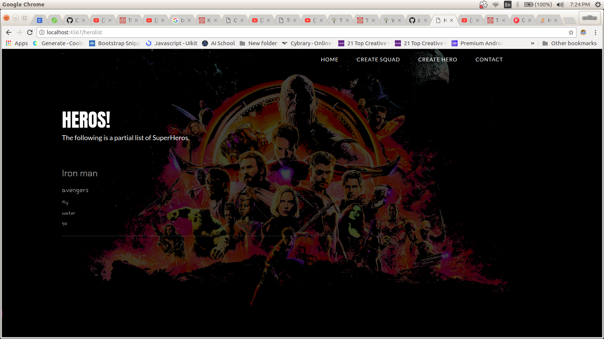

#                                                   HERO-SQUAD! :santa:

# DISPLAY


---

---

---

---

---

# AUTHOR

COLLINS KARIUKI


## DESCRIPTION

This is an app that allows user to recruit a well-balanced team of superheroes. The superheros also must be able to be added into a super hero group called **superhero-squad** hence the name Hero-Squad.

[Check-Out App!](https://squad-hero.herokuapp.com/squadform)

## User Story

- Users can add a Hero Squad.

- Users can add a Hero.

- Users can view squads and Heros created.

## PRE-REQUISITES.

A couple of things to get you started:

1. Ensure you have [Java](https://java.com/en/download/) installed

A simple way to install Java is using [sdkman](https://sdkman.io/).

Simply follow the instructions to have _sdkman_ installed and install java:

```bash
sdk install java
```

2. [Gradle](https://gradle.org/)

Gradle is used as the build tool and can be installed with sdkman:

```bash
sdk install gradle
```

# **SETUP/INSTALLATION!**

**{follow the below instructions for set up.}**

1. You will need Internet connection.

2. You need to get into the Hero-Squad Repository.

Link:-> ```https://github.com/zecollokaris/Hero-Squad-Spark```

3. From there you can access the Hero-Squad.

4. **Clone** the project.

5. **get into project folder** (cd into project).

6. If you have all the **Pre-requisites** you can run the application.

```
gradle run
```
### TECHNOLOGIES USED:

- **[Java](https://java.com/en/download/) - source language.**

- **[Gradle](https://gradle.org/) for dependency management and running tasks.**

- Bootstrap.

- Cascading Style Sheets.

- Apache Velocity Engine.

## Support & Contact

- Mobile number: (+254) 798731203

- Email Address: collo.kariss@gmail.com

- github-username: zecollokaris

## License

The app is licensed by MIT. [**HERE**](LICENSE)